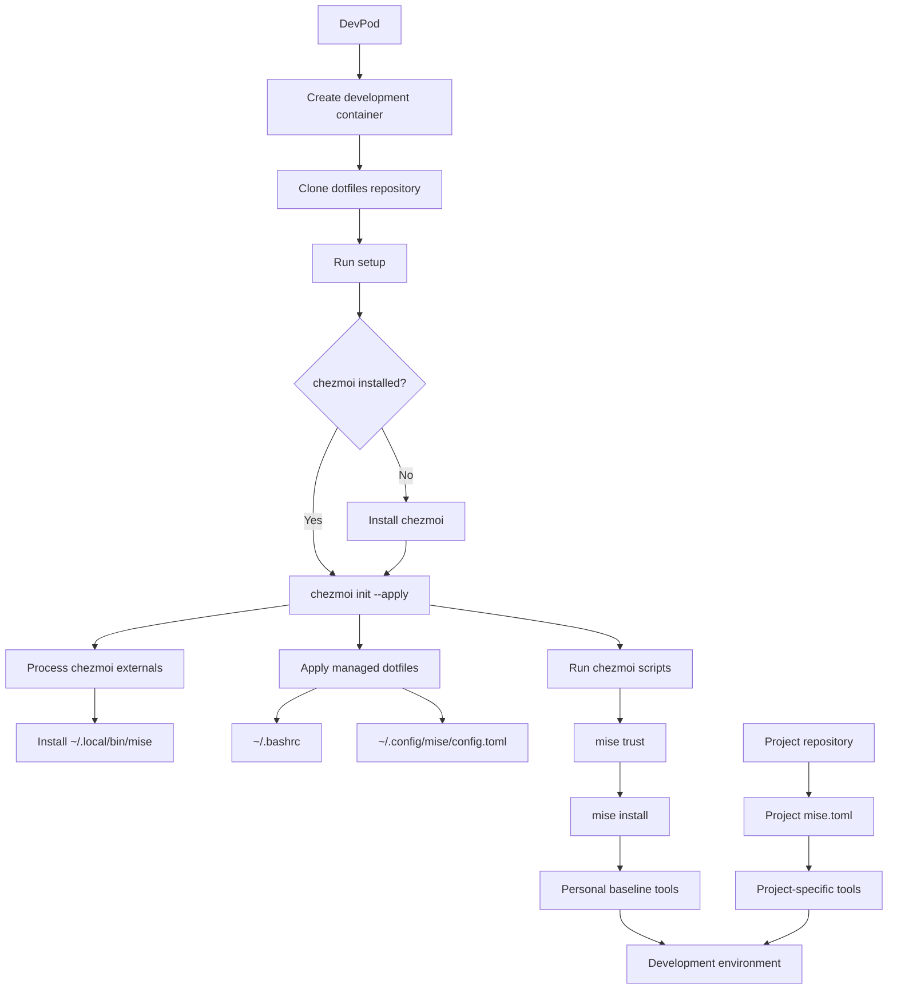

# Dotfiles

Portable development-environment configuration built around
[chezmoi](https://www.chezmoi.io/) and [mise](https://mise.jdx.dev/).

The repository is primarily intended to provide a consistent user environment
inside ephemeral development containers such as
[DevPod](https://devpod.sh/) workspaces.

The design deliberately separates:

- **personal environment configuration** — this repository
- **project-specific tooling and configuration** — each project's repository

This keeps development containers reproducible without forcing every project
to use the same toolchain.

---

## Architecture



---

## Responsibility Model

A useful rule for deciding where configuration belongs is:

> If it should exist in every development workspace, it belongs in the
> dotfiles repository. If a particular project requires it, it belongs in that
> project's repository.

### Dotfiles repository

Examples:

- shell configuration
- shell aliases
- Git preferences
- personal command-line utilities
- editor-independent CLI configuration
- mise itself
- general-purpose tools used in most workspaces

### Project repository

Examples:

- language runtimes
- Kubernetes tooling required by that project
- Terraform versions
- project-specific Python versions
- project-specific environment setup
- services and ports
- devcontainer configuration

For example:

```text
dotfiles
└── mise config
    ├── bat
    ├── chezmoi
    └── other general-purpose tools

project
└── mise.toml
    ├── kubectl
    ├── helm
    ├── terraform
    └── python
```

Both mise configurations can coexist. mise resolves configuration according to
the current working directory and environment.

---

## Repository Structure

```text
.
├── .chezmoiexternals/
│   └── mise.toml
│
├── .chezmoiignore
│
├── .chezmoiscripts/
│   └── run_onchange_after_install_packages.sh.tmpl
│
├── dot_bashrc
│
├── dot_config/
│   └── mise/
│       └── config.toml
│
└── setup
```

Each part has a specific role.

---

## Bootstrap Flow

### 1. DevPod clones the repository

DevPod can use a Git repository as its dotfiles source.

When a workspace is created, DevPod clones this repository into the
development container and looks for a supported bootstrap script.

This repository provides:

```text
setup
```

---

### 2. `setup` bootstraps chezmoi

The `setup` script checks whether chezmoi is available.

If it is not installed, it invokes the chezmoi installer and initializes this
repository:

```bash
chezmoi init --apply <dotfiles-repository>
```

From this point forward, chezmoi owns the dotfile installation process.

---

### 3. chezmoi installs mise

The repository contains:

```text
.chezmoiexternals/mise.toml
```

This declares mise as an external executable and installs it as:

```text
~/.local/bin/mise
```

Using a chezmoi external avoids requiring mise to already exist before the
dotfiles can be applied.

The bootstrap chain is therefore:

```text
DevPod
   ↓
setup
   ↓
chezmoi
   ↓
mise
```

Each layer installs or configures the next one.

---

## Managed Files

chezmoi uses filename conventions to describe the destination of managed
files.

For example:

```text
dot_bashrc
```

becomes:

```text
~/.bashrc
```

and:

```text
dot_config/mise/config.toml
```

becomes:

```text
~/.config/mise/config.toml
```

The repository is therefore the **source state**, while the files under the
user's home directory are the **applied state**.

Useful commands:

```bash
chezmoi managed
```

List files managed by chezmoi.

```bash
chezmoi source-path
```

Show the local source repository.

```bash
chezmoi diff
```

Show differences between the source state and the currently applied files.

```bash
chezmoi apply
```

Apply the current source state.

---

## Tool Management with mise

The global mise configuration is stored at:

```text
dot_config/mise/config.toml
```

chezmoi materializes this as:

```text
~/.config/mise/config.toml
```

It contains tools that should generally be available in every workspace.

Example:

```toml
[tools]
bat = "latest"
chezmoi = "latest"
```

Project repositories can independently contain their own:

```text
mise.toml
```

For example:

```toml
[tools]
python = "3.13"
terraform = "1.12"
kubectl = "1.33"
```

This allows the environment to have two layers:

```text
~/.config/mise/config.toml
        │
        └── baseline user tools

<project>/mise.toml
        │
        └── project-specific tools
```

---

## Automatic Tool Installation

The repository contains a chezmoi script:

```text
.chezmoiscripts/run_onchange_after_install_packages.sh.tmpl
```

The script includes a hash derived from the mise configuration.

When the mise configuration changes, chezmoi detects that the generated script
has changed and runs:

```bash
mise trust ~/.config/mise/config.toml
mise install
```

This means adding a tool to the global mise configuration is enough to trigger
its installation the next time chezmoi applies the repository.

---

## Adding a Global Tool

Edit:

```text
dot_config/mise/config.toml
```

For example:

```toml
[tools]
bat = "latest"
chezmoi = "latest"
jq = "latest"
```

Then apply the repository:

```bash
chezmoi apply
```

The onchange script will run `mise install` when necessary.

Use this mechanism only for tools that are expected to be useful in most
development workspaces.

Project-specific dependencies should remain in the project's own
`mise.toml`.

---

## Adding a Managed Configuration File

A file intended to become:

```text
~/.exampleconfig
```

can be represented in the repository as:

```text
dot_exampleconfig
```

A file intended to become:

```text
~/.config/example/config.toml
```

can be represented as:

```text
dot_config/example/config.toml
```

chezmoi supports additional filename attributes for executable, private,
encrypted, and templated files.

Refer to the chezmoi documentation before adding sensitive configuration.

---

## Shell Configuration

The Bash configuration is intentionally kept small.

Its job is limited to user-level behavior such as:

- history settings
- shell editing mode
- PATH configuration
- completion
- aliases
- mise activation

Distribution-specific configuration should generally remain the
responsibility of the development-container base image.

This reduces coupling between the dotfiles repository and any particular Linux
distribution or container image.

---

## Security

This repository is intended to be safe for public hosting.

Do **not** commit:

- SSH private keys
- API tokens
- GitHub authentication files
- cloud-provider credentials
- kubeconfig files containing credentials
- passwords
- application secrets
- private environment files

Authentication should be provided through the workspace runtime, credential
forwarding, environment injection, secret stores, or another appropriate
external mechanism.

The dotfiles repository should describe the development environment, not
contain the credentials used by that environment.

---

## DevPod Mental Model

DevPod itself is not the development environment.

It is the system that creates and connects the pieces:

```text
DevPod
  │
  ├── container provider
  │      └── Docker / Kubernetes / remote provider
  │
  ├── devcontainer
  │      └── project environment definition
  │
  ├── project repository
  │      └── project-specific configuration
  │
  └── dotfiles
         └── user environment configuration
```

A useful shorthand is:

```text
DevPod       = workspace launcher
Devcontainer = workspace definition
chezmoi      = configuration manager
mise         = tool/version manager
dotfiles     = reusable user environment
project repo = project-specific environment
```

---

## Design Goal

The goal of this repository is not to reproduce an entire machine.

It provides a small, portable user layer that can be placed on top of a
reproducible development container.

The resulting model is:

```text
container image
      +
devcontainer configuration
      +
project configuration
      +
dotfiles
      =
ready-to-use development workspace
```
